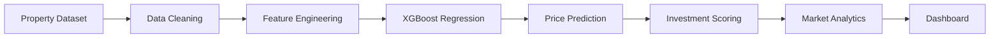

<div align="center">

# 🏠 EstateIQ

### AI-Powered Property Valuation & Market Intelligence Platform

*An end-to-end machine learning platform that predicts residential property prices, analyzes neighborhood trends, evaluates investment opportunities, and delivers interactive market intelligence through advanced geospatial analytics and predictive modeling.*


</div>

---

# 📖 Overview

Accurate property valuation is one of the biggest challenges in the real estate industry. Property prices are influenced by numerous factors including location, neighborhood characteristics, property features, and market conditions.

EstateIQ demonstrates an end-to-end machine learning pipeline that predicts house prices, uncovers market trends, identifies high-value investment opportunities, and visualizes geographic price patterns through an interactive analytics dashboard.

The platform combines predictive modeling, feature engineering, geospatial analytics, and business intelligence to support informed real estate decisions.

---

# ✨ Core Features

## 🏡 Property Valuation

Predict residential property prices using:

- XGBoost Regression
- Advanced Feature Engineering
- Market Indicators
- Property Characteristics

---

## 📍 Geospatial Intelligence

Analyze location-based insights through:

- Neighborhood Clustering
- Price Heatmaps
- Geographic Distribution
- Location Value Analysis

---

## 📈 Market Analytics

Monitor:

- Price Trends
- Neighborhood Performance
- Market Growth
- Investment Hotspots

---

## 💰 Investment Scoring

Evaluate properties using:

- Investment Score (0–100)
- ROI Potential
- Price-to-Value Ratio
- Appreciation Potential

---

## 🔍 Comparable Property Analysis

Automatically identify:

- Similar Properties
- Nearby Listings
- Price Comparisons
- Market Benchmarks

---

## 📊 Interactive Dashboard

Explore analytics through:

- KPI Cards
- Price Distribution
- Interactive Maps
- Neighborhood Rankings
- Market Trends
- Investment Insights

---

# 🏗 Machine Learning Workflow



---

# 📊 Analytics Engine

The platform provides multiple layers of real estate intelligence.

### 🏡 Property Analytics

- Property Price Prediction
- Price Distribution
- Feature Importance
- Comparable Properties

---

### 📍 Location Intelligence

- Neighborhood Clustering
- Geographic Price Mapping
- Regional Performance
- Location Value Scores

---

### 💰 Investment Analytics

- ROI Estimation
- Investment Score
- Market Growth Analysis
- High-Potential Areas

---

### 📈 Market Intelligence

- Price Trends
- Demand Analysis
- Neighborhood Rankings
- Market Comparisons

---

# 📈 Model Performance

| Metric | Score |
|---------|-------:|
| R² Score | **0.94** |
| RMSE | **$45K** |
| MAE | **$32K** |
| Properties Analyzed | **13,000+** |

---

# 🛠 Technology Stack

| Category | Technology |
|-----------|------------|
| Programming | Python |
| Machine Learning | XGBoost, Scikit-learn |
| Data Processing | Pandas, NumPy |
| Geospatial Analysis | Latitude/Longitude Clustering |
| Visualization | Plotly, Matplotlib |
| Dashboard | Streamlit |

---

# 📂 Repository Structure

```text
EstateIQ/
│
├── dashboard/
├── data/
├── models/
├── src/
├── train.py
├── requirements.txt
└── README.md
```

---

# 🎯 Skills Demonstrated

- Regression Modeling
- Feature Engineering
- XGBoost
- Geospatial Analytics
- Property Valuation
- Investment Analytics
- Data Visualization
- Dashboard Development
- Predictive Modeling
- Business Intelligence

---

# 🏢 Business Applications

EstateIQ can support:

- 🏘 Property Valuation
- 🏢 Real Estate Agencies
- 💰 Investment Analysis
- 📍 Market Intelligence
- 🏦 Mortgage Risk Assessment
- 📊 Property Portfolio Management
- 🌍 PropTech Solutions

---

# ⚙ Getting Started

Clone the repository:

```bash
git clone https://github.com/your-username/estateiq.git
```

Install dependencies:

```bash
pip install -r requirements.txt
```

Train the prediction model:

```bash
python train.py
```

Launch the dashboard:

```bash
streamlit run dashboard/app.py
```

---

# 💡 Why This Project?

Property valuation requires balancing historical data, geographic context, and market dynamics to generate reliable predictions.

EstateIQ demonstrates how machine learning, geospatial analytics, and interactive business intelligence can be combined into a practical decision-support platform for real estate professionals, investors, and PropTech applications. It showcases expertise in predictive modeling, feature engineering, spatial analysis, and end-to-end analytics.
